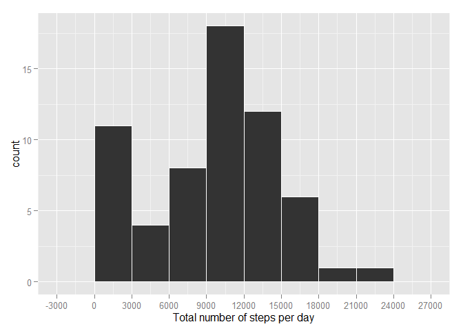
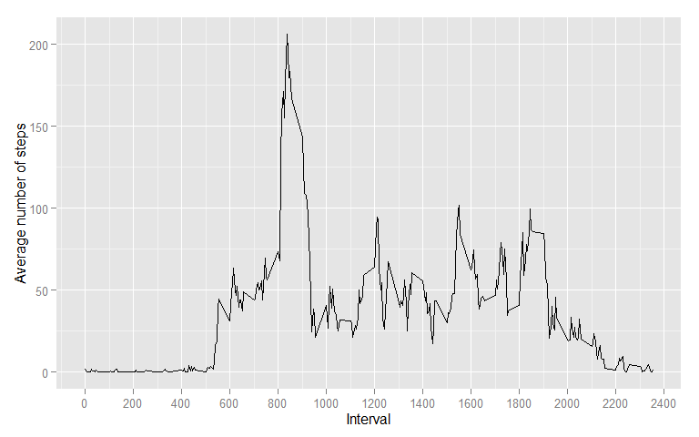

# Reproducible Research: Peer Assessment 1


## Loading and preprocessing the data

Unzip the archive that holds activity.csv file, then read the data

```r
unzip("activity.zip")
pa1_data <- read.csv("activity.csv")
```

## What is mean total number of steps taken per day?

I choose to use ggplot2 to make plots, so first load the ggplot2 library

```r
library(ggplot2)
```

Calculate total number of steps taken each day

```r
pa1_data_day <- tapply(pa1_data$steps, pa1_data$date, sum, na.rm = TRUE)
```

Make a historgram of total number of steps taken each day calculated in previous step

```r
ggplot(NULL, aes(x=pa1_data_day)) + geom_histogram(binwidth = 3000, colour = "white") +scale_x_continuous(breaks = c(-3000, 0, 3000, 6000, 9000, 12000, 15000, 18000, 21000, 24000, 27000)) + xlab("Total number of steps per day")
```

 

Compute mean and median of total number of steps taken each day

```r
pa1_mean <- mean(pa1_data_day, na.rm = TRUE)
pa1_median <- median(pa1_data_day, na.rm = TRUE)
```

The mean of the steps per day (removing NA from calculation) is **9354.2295082**, and the median is **10395**

## What is the average daily activity pattern?
Prepare data by computing average number of steps taken in given interval, averaged across all days

```r
pa1_data_averageint <- tapply(pa1_data$steps, pa1_data$interval, mean, na.rm = TRUE)
```

Make line plot

```r
ggplot(NULL, aes(x = as.numeric(names(pa1_data_averageint)), y=pa1_data_averageint,)) + geom_line() + xlab("Interval") + ylab("Average number of steps") + scale_x_continuous(breaks = seq(0, 2400, by = 200))
```

 

Find the interval with maximum average number of steps 
*(it can probably by done easier, but I don't know how :))*

```r
pa1_interval <- names(pa1_data_averageint[(pa1_data_averageint == max(pa1_data_averageint))])
```
The interval that contains maximum average number of steps is **835**

## Imputing missing values


## Are there differences in activity patterns between weekdays and weekends?
