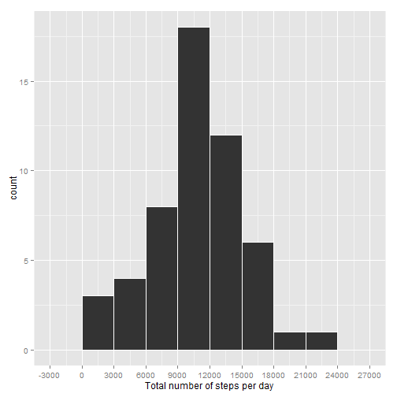
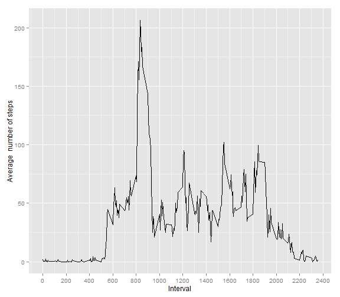
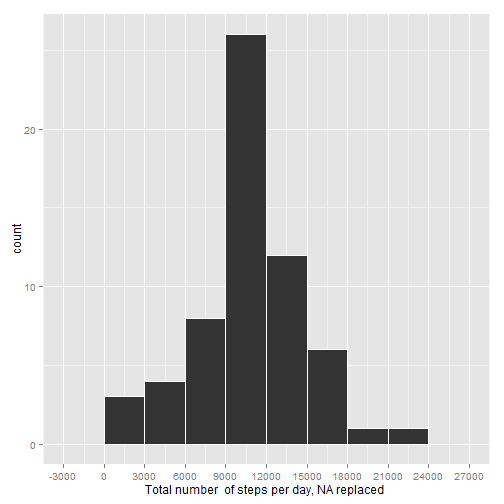
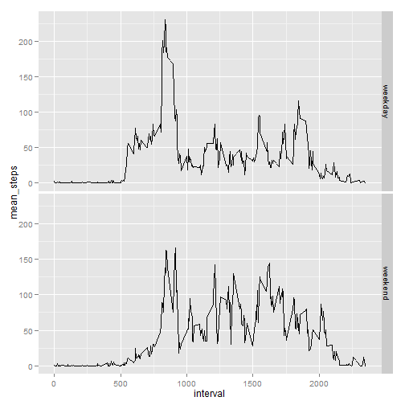

## Requirements

Two libraries are used in the analysis, please install them using install.packages()  
1. ggplot2  
2. plyr  

## Loading and preprocessing the data

Unzip the archive that holds activity.csv file, then read the data

```r
unzip("activity.zip")
pa1_data <- read.csv("activity.csv")
```

## What is mean total number of steps taken per day?

I choose to use ggplot2 to make plots, so first load the ggplot2 library

```r
library(ggplot2)
```

First part of the assigment requires omniting NA, so new data set of only complete cases is created

```r
pa1_complete_data <- pa1_data[complete.cases(pa1_data), ]
```

Calculate total number of steps taken each day

```r
pa1_data_day <- tapply(pa1_complete_data$steps, pa1_complete_data$date, sum,  na.rm = TRUE)
```

Make a historgram of total number of steps taken each day calculated in previous step

```r
pa1_breaks <- c(-3000, 0, 3000, 6000, 9000, 12000, 15000, 18000, 21000, 24000, 27000)
g1 <- ggplot(NULL, aes(x=pa1_data_day))
g1 <- g1 + geom_histogram(binwidth = 3000, colour = "white")
g1 <- g1 + scale_x_continuous(breaks = pa1_breaks)
g1 <- g1 + xlab("Total  number of steps per day ")
g1
```

 

*Additional and I think interestin comment: In my approach I created new dataset using complete.cases () function and then computed pa1_data_day from it. This approach leaves NA in pa1_data_day for days when all intervals had NA in steps column, but then ggplot takes care of it and eliminate those NA from the graph. Another possible approach is to compute pa1_data_day directly from pa1_data and leaving the elimination of NA to na.rm = TRUE. BUT IT LEADS TO DIFFERENT RESULTS - the second approach leads to conversion of NA to 0 for days when all records for "steps" column are NAs! The histogram created from this data shows elevated bar for 0 steps (actualy the bar is 12 high!)*

Compute mean and median of total number of steps taken each day

```r
pa1_mean <- mean(pa1_data_day, na.rm = TRUE)
pa1_median <- median(pa1_data_day, na.rm = TRUE)
```

The rounded mean of the steps per day is **10766.19**, and the median is **10765** 

## What is the average daily activity pattern?
Prepare data by computing average number of steps taken in given interval, averaged across all days

```r
pa1_data_averageint <- tapply(pa1_complete_data$steps, pa1_complete_data$interval,  mean, na.rm = TRUE)
```

Make line plot

```r
g2 <- ggplot(NULL, aes(x = as.numeric(names(pa1_data_averageint)), y=pa1_data_averageint,))
g2 <- g2 + geom_line() + xlab("Interval") +  ylab("Average  number of steps")
g2 <- g2 + scale_x_continuous(breaks = seq(0, 2400, by = 200))
g2
```

 

Find the interval with maximum average number of steps 
*(it can probably by done easier, but I don't know how :))*

```r
pa1_interval <- names(pa1_data_averageint[(pa1_data_averageint == max(pa1_data_averageint))])
```
The interval that contains maximum average number of steps is **835**

## Imputing missing values

Calculate the total number of missing values

```r
pa1_missing = dim(pa1_data)[1] - sum(complete.cases(pa1_data))
```
Total number of missing values in the dataset is **2304**

The strategy to fill in missing values is to put the mean for particular **interval** from all remaining days. This mean is already calculated as **pa1_data_averageint**

Copy the dataset

```r
pa1_data2 <- pa1_data
```

Change missing values for means of particular interval, using new dataset **pa1_data2**

```r
for (i in names(pa1_data_averageint)) {
    pa1_data2$steps[is.na(pa1_data2$steps) & (pa1_data2$interval == i)]  <- pa1_data_averageint[i]
}
```

Make a histogram of the total number of steps taken each day and calculate and report the mean and median total number of steps taken per day. The steps are simmilar to those taken earlier in pt. 1 and 2

```r
pa1_data2_day <- tapply(pa1_data2$steps, pa1_data2$date, sum, na.rm = TRUE)

g3 <- ggplot(NULL, aes(x=pa1_data2_day))
g3 <- g3 + geom_histogram(binwidth = 3000, colour = "white")
g3 <- g3 + scale_x_continuous(breaks = pa1_breaks)
g3 <- g3 + xlab("Total number  of steps per day, NA replaced ")
g3
```

 

```r
pa1_mean2 <- mean(pa1_data2_day, na.rm = TRUE)
pa1_median2 <- median(pa1_data2_day, na.rm = TRUE)
```

The mean of the steps per day, after filling NA as averages for particular interval, is **10766.19**, and the median is **10766.19**

The mean is exactly the same after replacing the NA with mean (which should not be a surprise). The median changed a little, by **1.1887**

## Are there differences in activity patterns between weekdays and weekends?
Set locale to display names of the day in English and add column to the pa1_data2 with weekday as a factor 


```r
Sys.setlocale("LC_TIME", "English")
```

```
## [1] "English_United States.1252"
```

```r
weekdays <- weekdays(as.Date(as.character(pa1_data2$date)))
weekdays <- replace(weekdays, weekdays %in% c("Monday", "Tuesday", "Wednesday", "Thursday", "Friday"), "weekday")
weekdays <- replace(weekdays, weekdays %in% c("Saturday", "Sunday"), "weekend")
pa1_data2$Weekday <- factor(weekdays)
```

To perform summarising the data for the last graph, I use plyr library and its functions ddply and summarise


```r
library(plyr)
pa1_data3 <- ddply(pa1_data2, c("Weekday", "interval"), summarise, mean_steps = mean(steps))
g4 <- ggplot(pa1_data3, aes(x=interval, y = mean_steps)) + facet_grid(Weekday~.)
g4 <- g4 + geom_line() + xlab("Interval")
g4
```

 

As can be seen, there are differences in mean number of steps during weekdays and weekends. During weekends activities start much later, and are more consistent during the day (probably because not sitting behind the desk in work :)
